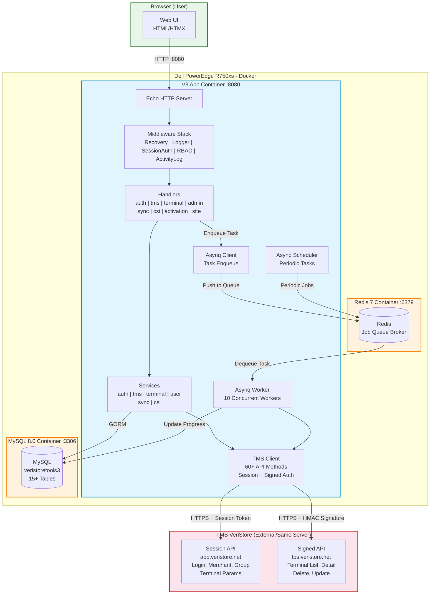

# 1. Architecture Diagram

System components and how they connect.

```mermaid
graph TB
    subgraph Browser["Browser (User)"]
        UI["Web UI<br/>HTML/HTMX"]
    end

    subgraph Dell["Dell PowerEdge R750xs - Docker"]
        subgraph AppContainer["V3 App Container :8080"]
            Echo["Echo HTTP Server"]
            MW["Middleware Stack<br/>Recovery | Logger | SessionAuth | RBAC | ActivityLog"]
            Handlers["Handlers<br/>auth | tms | terminal | admin<br/>sync | csi | activation | site"]
            Services["Services<br/>auth | tms | terminal | user<br/>sync | csi"]
            TMSClient["TMS Client<br/>60+ API Methods<br/>Session + Signed Auth"]
            Queue["Asynq Client<br/>Task Enqueue"]
            Worker["Asynq Worker<br/>10 Concurrent Workers"]
            Scheduler["Asynq Scheduler<br/>Periodic Tasks"]
        end

        subgraph MySQLContainer["MySQL 8.0 Container :3306"]
            MySQL[("MySQL<br/>veristoretools3<br/>15+ Tables")]
        end

        subgraph RedisContainer["Redis 7 Container :6379"]
            Redis[("Redis<br/>Job Queue Broker")]
        end
    end

    subgraph TMS["TMS VeriStore (External/Same Server)"]
        SessionAPI["Session API<br/>app.veristore.net<br/>Login, Merchant, Group<br/>Terminal Params"]
        SignedAPI["Signed API<br/>tps.veristore.net<br/>Terminal List, Detail<br/>Delete, Update"]
    end

    UI -->|"HTTP :8080"| Echo
    Echo --> MW --> Handlers
    Handlers --> Services
    Services --> TMSClient
    Services -->|"GORM"| MySQL
    Handlers -->|"Enqueue Task"| Queue
    Queue -->|"Push to Queue"| Redis
    Redis -->|"Dequeue Task"| Worker
    Worker --> TMSClient
    Worker -->|"Update Progress"| MySQL
    Scheduler -->|"Periodic Jobs"| Redis
    TMSClient -->|"HTTPS + Session Token"| SessionAPI
    TMSClient -->|"HTTPS + HMAC Signature"| SignedAPI

    classDef container fill:#e1f5fe,stroke:#0288d1,stroke-width:2px
    classDef db fill:#fff3e0,stroke:#f57c00,stroke-width:2px
    classDef external fill:#fce4ec,stroke:#c62828,stroke-width:2px
    classDef browser fill:#e8f5e9,stroke:#2e7d32,stroke-width:2px

    class AppContainer container
    class MySQLContainer,RedisContainer db
    class TMS external
    class Browser browser
```
