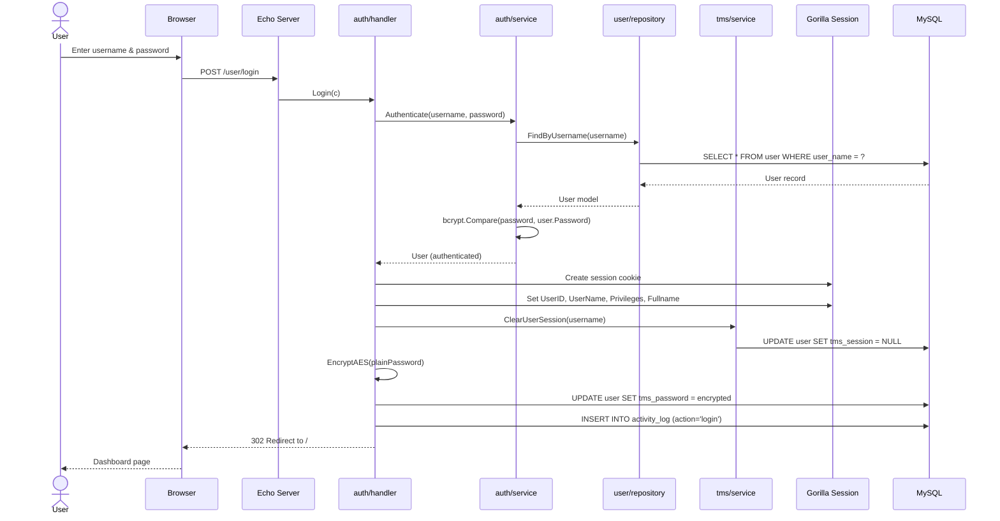
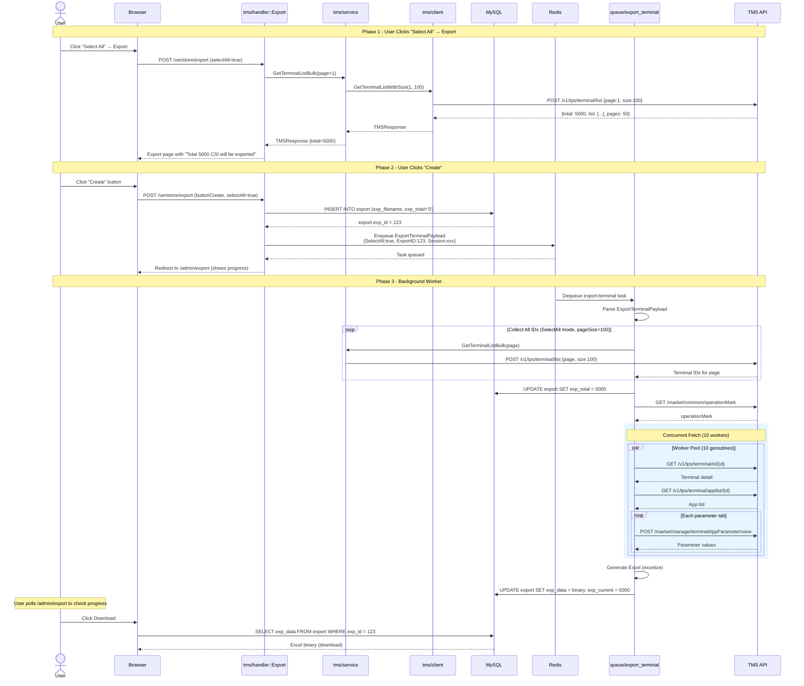
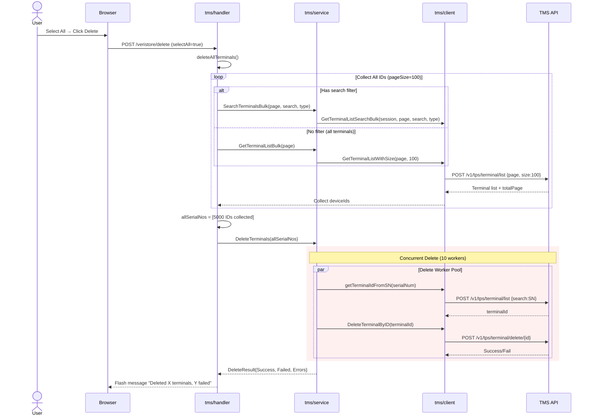
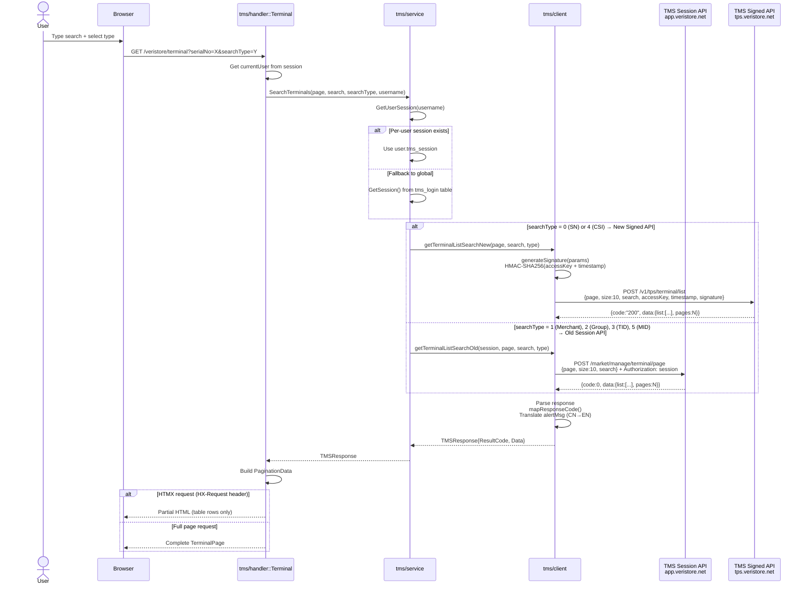

# 2. Sequence Diagrams

## 2.1 Login Flow

```mermaid
sequenceDiagram
    actor User
    participant Browser
    participant Echo as Echo Server
    participant AuthH as auth/handler
    participant AuthS as auth/service
    participant UserRepo as user/repository
    participant TMSS as tms/service
    participant Session as Gorilla Session
    participant DB as MySQL

    User->>Browser: Enter username & password
    Browser->>Echo: POST /user/login
    Echo->>AuthH: Login(c)

    AuthH->>AuthS: Authenticate(username, password)
    AuthS->>UserRepo: FindByUsername(username)
    UserRepo->>DB: SELECT * FROM user WHERE user_name = ?
    DB-->>UserRepo: User record
    UserRepo-->>AuthS: User model
    AuthS->>AuthS: bcrypt.Compare(password, user.Password)
    AuthS-->>AuthH: User (authenticated)

    AuthH->>Session: Create session cookie
    AuthH->>Session: Set UserID, UserName, Privileges, Fullname

    AuthH->>TMSS: ClearUserSession(username)
    TMSS->>DB: UPDATE user SET tms_session = NULL

    AuthH->>AuthH: EncryptAES(plainPassword)
    AuthH->>DB: UPDATE user SET tms_password = encrypted

    AuthH->>DB: INSERT INTO activity_log (action='login')

    AuthH-->>Browser: 302 Redirect to /
    Browser-->>User: Dashboard page
```

## 2.2 Export Flow

```mermaid
sequenceDiagram
    actor User
    participant Browser
    participant Handler as tms/handler::Export
    participant Service as tms/service
    participant TMSClient as tms/client
    participant DB as MySQL
    participant Redis
    participant Worker as queue/export_terminal
    participant TMS as TMS API

    Note over User,TMS: Phase 1 - User Clicks "Select All" → Export

    User->>Browser: Click "Select All" → Export
    Browser->>Handler: POST /veristore/export (selectAll=true)

    Handler->>Service: GetTerminalListBulk(page=1)
    Service->>TMSClient: GetTerminalListWithSize(1, 100)
    TMSClient->>TMS: POST /v1/tps/terminal/list {page:1, size:100}
    TMS-->>TMSClient: {total: 5000, list: [...], pages: 50}
    TMSClient-->>Service: TMSResponse
    Service-->>Handler: TMSResponse (total=5000)

    Handler-->>Browser: Export page with "Total 5000 CSI will be exported"

    Note over User,TMS: Phase 2 - User Clicks "Create"

    User->>Browser: Click "Create" button
    Browser->>Handler: POST /veristore/export (buttonCreate, selectAll=true)

    Handler->>DB: INSERT INTO export (exp_filename, exp_total='0')
    DB-->>Handler: export.exp_id = 123

    Handler->>Redis: Enqueue ExportTerminalPayload<br/>{SelectAll:true, ExportID:123, Session:xxx}
    Redis-->>Handler: Task queued

    Handler-->>Browser: Redirect to /admin/export (shows progress)

    Note over User,TMS: Phase 3 - Background Worker

    Redis->>Worker: Dequeue export:terminal task
    Worker->>Worker: Parse ExportTerminalPayload

    loop Collect All IDs (SelectAll mode, pageSize=100)
        Worker->>Service: GetTerminalListBulk(page)
        Service->>TMS: POST /v1/tps/terminal/list {page, size:100}
        TMS-->>Worker: Terminal IDs for page
    end

    Worker->>DB: UPDATE export SET exp_total = 5000

    Worker->>TMS: GET /market/common/operationMark
    TMS-->>Worker: operationMark

    rect rgb(230, 245, 255)
        Note over Worker,TMS: Concurrent Fetch (10 workers)
        par Worker Pool (10 goroutines)
            Worker->>TMS: GET /v1/tps/terminal/id/{id}
            TMS-->>Worker: Terminal detail
            Worker->>TMS: GET /v1/tps/terminal/applist/{id}
            TMS-->>Worker: App list
            loop Each parameter tab
                Worker->>TMS: POST /market/manage/terminalAppParameter/view
                TMS-->>Worker: Parameter values
            end
        end
    end

    Worker->>Worker: Generate Excel (excelize)
    Worker->>DB: UPDATE export SET exp_data = binary, exp_current = 5000

    Note over User: User polls /admin/export to check progress
    User->>Browser: Click Download
    Browser->>DB: SELECT exp_data FROM export WHERE exp_id = 123
    DB-->>Browser: Excel binary (download)
```

## 2.3 Delete All Flow

```mermaid
sequenceDiagram
    actor User
    participant Browser
    participant Handler as tms/handler
    participant Service as tms/service
    participant TMSClient as tms/client
    participant TMS as TMS API

    User->>Browser: Select All → Click Delete
    Browser->>Handler: POST /veristore/delete (selectAll=true)

    Handler->>Handler: deleteAllTerminals()

    loop Collect All IDs (pageSize=100)
        alt Has search filter
            Handler->>Service: SearchTerminalsBulk(page, search, type)
            Service->>TMSClient: GetTerminalListSearchBulk(session, page, search, type)
        else No filter (all terminals)
            Handler->>Service: GetTerminalListBulk(page)
            Service->>TMSClient: GetTerminalListWithSize(page, 100)
        end
        TMSClient->>TMS: POST /v1/tps/terminal/list {page, size:100}
        TMS-->>TMSClient: Terminal list + totalPage
        TMSClient-->>Handler: Collect deviceIds
    end

    Handler->>Handler: allSerialNos = [5000 IDs collected]
    Handler->>Service: DeleteTerminals(allSerialNos)

    rect rgb(255, 240, 240)
        Note over Service,TMS: Concurrent Delete (10 workers)
        par Delete Worker Pool
            Service->>TMSClient: getTerminalIdFromSN(serialNum)
            TMSClient->>TMS: POST /v1/tps/terminal/list {search:SN}
            TMS-->>TMSClient: terminalId
            Service->>TMSClient: DeleteTerminalByID(terminalId)
            TMSClient->>TMS: POST /v1/tps/terminal/delete/{id}
            TMS-->>TMSClient: Success/Fail
        end
    end

    Service-->>Handler: DeleteResult{Success, Failed, Errors}
    Handler-->>Browser: Flash message "Deleted X terminals, Y failed"
```

## 2.4 Search Flow (Old vs New API)

```mermaid
sequenceDiagram
    actor User
    participant Browser
    participant Handler as tms/handler::Terminal
    participant Service as tms/service
    participant TMSClient as tms/client
    participant SessionAPI as TMS Session API<br/>app.veristore.net
    participant SignedAPI as TMS Signed API<br/>tps.veristore.net

    User->>Browser: Type search + select type
    Browser->>Handler: GET /veristore/terminal?serialNo=X&searchType=Y

    Handler->>Handler: Get currentUser from session

    Handler->>Service: SearchTerminals(page, search, searchType, username)
    Service->>Service: GetUserSession(username)

    alt Per-user session exists
        Service->>Service: Use user.tms_session
    else Fallback to global
        Service->>Service: GetSession() from tms_login table
    end

    alt searchType = 0 (SN) or 4 (CSI) → New Signed API
        Service->>TMSClient: getTerminalListSearchNew(page, search, type)
        TMSClient->>TMSClient: generateSignature(params)<br/>HMAC-SHA256(accessKey + timestamp)
        TMSClient->>SignedAPI: POST /v1/tps/terminal/list<br/>{page, size:10, search, accessKey, timestamp, signature}
        SignedAPI-->>TMSClient: {code:"200", data:{list:[...], pages:N}}
    else searchType = 1 (Merchant), 2 (Group), 3 (TID), 5 (MID) → Old Session API
        Service->>TMSClient: getTerminalListSearchOld(session, page, search, type)
        TMSClient->>SessionAPI: POST /market/manage/terminal/page<br/>{page, size:10, search} + Authorization: session
        SessionAPI-->>TMSClient: {code:0, data:{list:[...], pages:N}}
    end

    TMSClient->>TMSClient: Parse response<br/>mapResponseCode()<br/>Translate alertMsg (CN→EN)
    TMSClient-->>Service: TMSResponse{ResultCode, Data}
    Service-->>Handler: TMSResponse

    Handler->>Handler: Build PaginationData

    alt HTMX request (HX-Request header)
        Handler-->>Browser: Partial HTML (table rows only)
    else Full page request
        Handler-->>Browser: Complete TerminalPage
    end
```
