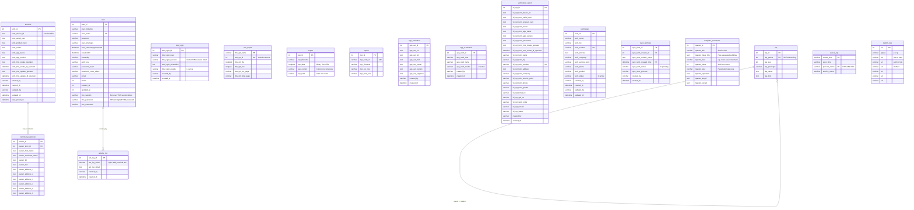

# 3. Entity Relationship Diagram (ERD)

Database schema for VeriStore Tools V3 (MySQL 8.0).

```mermaid
erDiagram
    user {
        int user_id PK
        varchar user_fullname
        varchar user_name UK
        varchar password
        varchar user_privileges
        datetime user_lastchangepassword
        datetime createddtm
        varchar createdby
        varchar auth_key
        varchar password_hash
        varchar password_reset_token
        varchar email
        int status
        int created_at
        int updated_at
        varchar tms_session "Per-user TMS session token"
        varchar tms_password "AES encrypted TMS password"
        varchar tms_username
    }

    terminal {
        int term_id PK
        text term_device_id "CSI identifier"
        text term_serial_num
        text term_product_num
        text term_model
        text term_app_name
        text term_app_version
        text term_tms_create_operator
        datetime term_tms_create_dt_operator
        text term_tms_update_operator
        datetime term_tms_update_dt_operator
        varchar created_by
        datetime created_dt
        varchar updated_by
        datetime updated_dt
        datetime last_synced_at
    }

    terminal_parameter {
        int param_id PK
        int param_term_id FK
        text param_host_name
        text param_merchant_name
        text param_tid
        text param_mid
        text param_address_1
        text param_address_2
        text param_address_3
        text param_address_4
        text param_address_5
        text param_address_6
    }

    tms_login {
        int tms_login_id PK
        varchar tms_login_user
        varchar tms_login_session "Global TMS session token"
        text tms_login_scheduled
        varchar tms_login_enable "1=active"
        varchar created_by
        datetime created_dt
    }

    tms_report {
        varchar tms_rpt_name PK
        int tms_rpt_id UK "Auto-increment"
        longblob tms_rpt_file
        longtext tms_rpt_row
        varchar tms_rpt_cur_page
        varchar tms_rpt_total_page
    }

    activity_log {
        int act_log_id PK
        varchar act_log_action "login, add_terminal, etc."
        text act_log_detail
        varchar created_by
        datetime created_dt
    }

    export {
        int exp_id PK
        varchar exp_filename
        longblob exp_data "Binary Excel file"
        varchar exp_current "Current row progress"
        varchar exp_total "Total row count"
    }

    import {
        int imp_id PK
        varchar imp_code_id "CSI"
        varchar imp_filename
        varchar imp_cur_row
        varchar imp_total_row
    }

    app_activation {
        int app_act_id PK
        text app_act_csi
        text app_act_tid
        text app_act_mid
        text app_act_model
        text app_act_version
        text app_act_engineer
        varchar created_by
        datetime created_dt
    }

    app_credential {
        int app_cred_id PK
        varchar app_cred_user
        varchar app_cred_name
        varchar app_cred_enable "1=active"
        varchar created_by
        datetime created_dt
    }

    verification_report {
        int vfi_rpt_id PK
        text vfi_rpt_term_device_id
        text vfi_rpt_term_serial_num
        text vfi_rpt_term_product_num
        text vfi_rpt_term_model
        text vfi_rpt_term_app_name
        text vfi_rpt_term_app_version
        text vfi_rpt_term_parameter
        text vfi_rpt_term_tms_create_operator
        datetime vfi_rpt_term_tms_create_dt_operator
        varchar vfi_rpt_tech_name
        varchar vfi_rpt_tech_nip
        varchar vfi_rpt_tech_number UK
        text vfi_rpt_tech_address
        varchar vfi_rpt_tech_company
        varchar vfi_rpt_tech_sercive_point
        varchar vfi_rpt_tech_phone
        varchar vfi_rpt_tech_gender
        varchar vfi_rpt_ticket_no
        varchar vfi_rpt_spk_no
        varchar vfi_rpt_work_order
        varchar vfi_rpt_remark
        varchar vfi_rpt_status
        varchar created_by
        datetime created_dt
    }

    technician {
        int tech_id PK
        varchar tech_name
        varchar tech_nip
        varchar tech_number UK
        text tech_address
        varchar tech_company
        varchar tech_sercive_point
        varchar tech_phone
        varchar tech_gender
        varchar tech_status "1=active"
        varchar created_by
        datetime created_dt
        varchar updated_by
        datetime updated_dt
    }

    sync_terminal {
        int sync_term_id UK
        int sync_term_creator_id PK
        text sync_term_creator_name
        datetime sync_term_created_time PK
        varchar sync_term_status "0=pending"
        varchar sync_term_process
        varchar created_by
        datetime created_dt
    }

    template_parameter {
        int tparam_id PK
        varchar tparam_title "Section title"
        text tparam_index_title "Pipe-separated subtitles"
        varchar tparam_field "e.g. main-basic-merchant"
        int tparam_index "Sub-item count"
        varchar tparam_type "Parameter type code"
        text tparam_operation
        text tparam_length
        text tparam_except
    }

    faq {
        int faq_id PK
        int faq_parent FK "Self-referencing"
        int faq_seq
        varchar faq_privileges
        text faq_name
        text faq_link
    }

    queue_log {
        varchar create_time PK
        varchar exec_time
        varchar process_name PK "EXP, IMP, SYN"
        varchar service_name
    }

    casbin_rule {
        int id PK
        varchar ptype "p or g"
        varchar v0 "role or user"
        varchar v1 "path or role"
        varchar v2 "method"
        varchar v3
        varchar v4
        varchar v5
    }

    %% Relationships
    terminal ||--o{ terminal_parameter : "has parameters"
    faq ||--o{ faq : "parent → children"
    user ||--o{ activity_log : "created_by"
```
