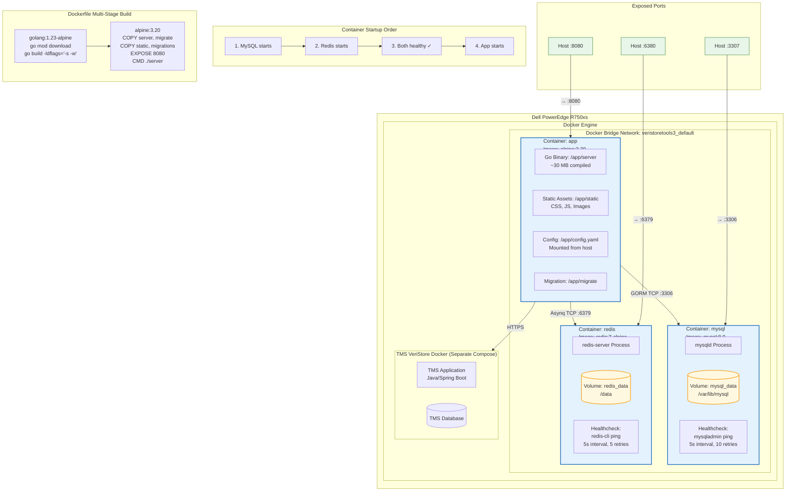

# 4. Deployment Diagram

Docker Compose layout on Dell PowerEdge R750xs.

## Environment Configuration

| Container | Environment Variable | Value |
|-----------|---------------------|-------|
| app | TZ | Asia/Jakarta |
| mysql | TZ | Asia/Jakarta |
| mysql | MYSQL_ROOT_PASSWORD | veristoretools3 |
| mysql | MYSQL_DATABASE | veristoretools3 |

## Volume Mounts

| Container | Host Path | Container Path | Mode |
|-----------|-----------|----------------|------|
| app | ./config.docker.yaml | /app/config.yaml | read-only |
| mysql | mysql_data (named) | /var/lib/mysql | read-write |
| redis | redis_data (named) | /data | read-write |
