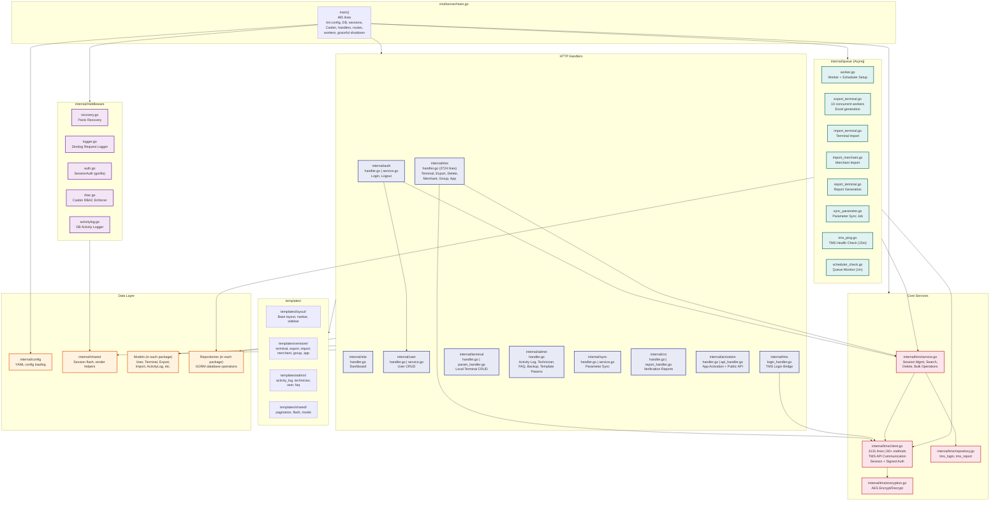

# 5. Component Diagram

Internal package structure of VeriStore Tools V3.

## Package Summary

| Package | Files | Purpose |
|---------|-------|---------|
| cmd/server | 1 | Application entry point, init & wiring |
| internal/config | 2 | YAML config loading & DSN builder |
| internal/middleware | 5 | Recovery, logging, auth, RBAC, activity log |
| internal/shared | ~3 | Flash messages, render helpers, DB utils |
| internal/auth | 5 | Login/logout, password verification |
| internal/user | 4 | User CRUD, password management |
| internal/tms | 10 | TMS API integration (core package) |
| internal/terminal | 6 | Local terminal CRUD |
| internal/admin | 4 | Activity log, technician, FAQ, backup |
| internal/sync | 4 | Parameter synchronization |
| internal/csi | 5 | Verification reports |
| internal/activation | 5 | App activation + public API |
| internal/queue | 9 | Background jobs (export, import, sync, ping) |
| internal/site | 1 | Dashboard |
