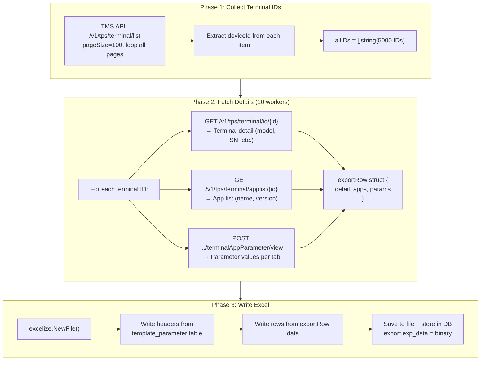

# 6. Data Flow Diagram

How terminal data moves through the system.

## 6.1 Terminal List Data Flow

```mermaid
graph LR
    subgraph TMS["TMS API"]
        API["POST /v1/tps/terminal/list<br/>Returns JSON:<br/>{code, desc, data:{list, pages, total}}"]
    end

    subgraph Client["tms/client.go"]
        Parse["Parse Response<br/>1. mapResponseCode(code)<br/>2. Extract data.list<br/>3. Rename alertStatus → status<br/>4. Translate alertMsg (CN→EN)<br/>5. Build TMSResponse struct"]
    end

    subgraph Service["tms/service.go"]
        SvcCall["GetTerminalList(page)<br/>or SearchTerminals(page, search, type)<br/>→ Route to correct API path<br/>→ Manage session tokens"]
    end

    subgraph Handler["tms/handler.go"]
        HdlProc["Terminal(c echo.Context)<br/>1. Extract query params<br/>2. Call service method<br/>3. Extract terminalList from resp.Data<br/>4. Build PaginationData<br/>5. Check HX-Request header"]
    end

    subgraph Template["templates/veristore/terminal.templ"]
        Render["TerminalPage / TerminalTablePartial<br/>1. Loop terminals []interface{}<br/>2. Type assert map[string]interface{}<br/>3. Display: deviceId, status, alertMsg<br/>4. Render action buttons<br/>5. Build pagination links"]
    end

    subgraph Browser["Browser"]
        HTML["Rendered HTML Table<br/>+ HTMX partial updates<br/>+ Pagination navigation"]
    end

    API -->|"JSON response"| Parse
    Parse -->|"TMSResponse{ResultCode, Data}"| SvcCall
    SvcCall -->|"TMSResponse"| HdlProc
    HdlProc -->|"PageData + PaginationData"| Render
    Render -->|"HTML"| HTML
```

## 6.2 Data Structures at Each Layer

```mermaid
graph TD
    subgraph Layer1["Layer 1: TMS API Response (Raw JSON)"]
        JSON["
        {
          code: '200',
          desc: 'success',
          data: {
            list: [
              {id, deviceId, sn, alertStatus, alertMsg, ...}
            ],
            pages: 100,
            total: 5000
          }
        }
        "]
    end

    subgraph Layer2["Layer 2: Go Struct (client.go)"]
        GoStruct["
        TMSResponse {
          ResultCode: int      // 0 = success
          Desc:       string   // 'success'
          Data: map[string]interface{} {
            'terminalList': []interface{},
            'totalPage':    int,
            'total':        int
          }
          RawData: interface{} // unstructured
        }
        "]
    end

    subgraph Layer3["Layer 3: Handler Processing"]
        HandlerData["
        terminals := resp.Data['terminalList']
        for each terminal (map[string]interface{}):
          deviceId  = terminal['deviceId'].(string)
          status    = terminal['status'].(string)
          alertMsg  = terminal['alertMsg'].(string)

        pagination := PaginationData {
          CurrentPage: pageNum,
          TotalPages:  totalPages,
          BaseURL:     '/veristore/terminal',
          QueryString: 'serialNo=X&searchType=Y'
        }
        "]
    end

    subgraph Layer4["Layer 4: Template Rendering"]
        TemplData["
        PageData {
          Title, AppName, AppVersion,
          UserName, UserPrivileges,
          Flashes: map[string][]string
        }
        +
        terminals []interface{}
        +
        PaginationData
        → Rendered to HTML via templ
        "]
    end

    Layer1 -->|"HTTP Response"| Layer2
    Layer2 -->|"Go types"| Layer3
    Layer3 -->|"Template args"| Layer4
```

## 6.3 Export Data Flow (Terminal → Excel)

```mermaid
graph TD
    subgraph Collect["Phase 1: Collect Terminal IDs"]
        A1["TMS API: /v1/tps/terminal/list<br/>pageSize=100, loop all pages"]
        A2["Extract deviceId from each item"]
        A3["allIDs = []string{5000 IDs}"]
        A1 --> A2 --> A3
    end

    subgraph Fetch["Phase 2: Fetch Details (10 workers)"]
        B1["For each terminal ID:"]
        B2["GET /v1/tps/terminal/id/{id}<br/>→ Terminal detail (model, SN, etc.)"]
        B3["GET /v1/tps/terminal/applist/{id}<br/>→ App list (name, version)"]
        B4["POST .../terminalAppParameter/view<br/>→ Parameter values per tab"]
        B5["exportRow struct {<br/>  detail, apps, params<br/>}"]
        B1 --> B2
        B1 --> B3
        B1 --> B4
        B2 & B3 & B4 --> B5
    end

    subgraph Write["Phase 3: Write Excel"]
        C1["excelize.NewFile()"]
        C2["Write headers from<br/>template_parameter table"]
        C3["Write rows from exportRow data"]
        C4["Save to file + store in DB<br/>export.exp_data = binary"]
        C1 --> C2 --> C3 --> C4
    end

    Collect --> Fetch --> Write
```
