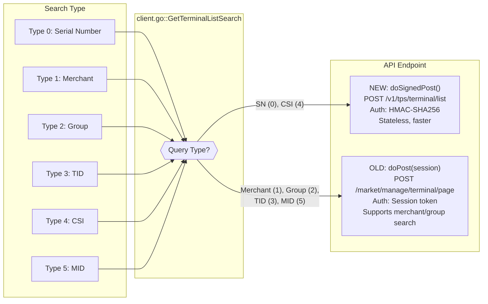
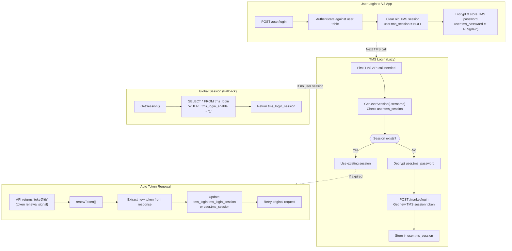

# 7. API Flow / Integration Diagram

TMS API endpoints, session management, and old vs new API paths.

## 7.1 Dual API Architecture

```mermaid
graph TB
    subgraph V3App["VeriStore Tools V3"]
        TMSClient["tms/client.go<br/>3131 lines | 60+ methods"]

        subgraph AuthMethods["Authentication"]
            HMACSign["generateSignature()<br/>HMAC-SHA256<br/>accessKey + timestamp<br/>sorted key=value pairs"]
            SessionToken["doPost(session, path, body)<br/>Authorization: session header<br/>Auto token renewal"]
        end
    end

    subgraph NewAPI["Signed API (tps.veristore.net)"]
        direction TB
        N1["POST /v1/tps/terminal/list<br/>List terminals (paginated)"]
        N2["GET /v1/tps/terminal/{serialNum}<br/>Terminal detail by SN"]
        N3["GET /v1/tps/terminal/id/{id}<br/>Terminal detail by ID"]
        N4["GET /v1/tps/terminal/applist/{id}<br/>Terminal app list"]
        N5["POST /v1/tps/terminal/delete/{id}<br/>Delete terminal"]
    end

    subgraph OldAPI["Session API (app.veristore.net)"]
        direction TB
        O1["POST /market/login<br/>Login (get session token)"]
        O2["POST /market/manage/terminal/page<br/>Search by Merchant/Group/TID/MID"]
        O3["POST /market/manage/terminalAppParameter/view<br/>Get terminal parameters"]
        O4["POST /market/manage/merchant/list<br/>Merchant management"]
        O5["POST /market/manage/group/list<br/>Group management"]
        O6["POST /market/manage/index/topSum<br/>Dashboard summary"]
        O7["POST /market/common/operationMark<br/>Operation mark"]
        O8["GET /market/common/getCountryList<br/>Location data (country/state/city)"]
        O9["GET /market/common/getVendorList<br/>Device vendors & models"]
        O10["POST /market/manage/app/list<br/>Application list"]
        O11["POST /market/common/checkToken<br/>Session validation"]
    end

    TMSClient -->|"HMAC-SHA256 Signature"| NewAPI
    TMSClient -->|"Session Token Header"| OldAPI

    classDef newapi fill:#e8f5e9,stroke:#2e7d32,stroke-width:2px
    classDef oldapi fill:#fff3e0,stroke:#f57c00,stroke-width:2px
    classDef client fill:#e3f2fd,stroke:#1565c0,stroke-width:2px

    class N1,N2,N3,N4,N5 newapi
    class O1,O2,O3,O4,O5,O6,O7,O8,O9,O10,O11 oldapi
    class TMSClient client
```

## 7.2 Search Type → API Routing

## 7.3 Session Management

## 7.4 Complete TMS API Endpoint Map

### Signed API (tps.veristore.net)

| Method | Endpoint | Purpose | Used By |
|--------|----------|---------|---------|
| POST | `/v1/tps/terminal/list` | List/search terminals | Terminal page, Export, Delete |
| GET | `/v1/tps/terminal/{sn}` | Detail by serial number | Terminal detail |
| GET | `/v1/tps/terminal/id/{id}` | Detail by ID | Export worker |
| GET | `/v1/tps/terminal/applist/{id}` | Apps on terminal | Export worker |
| POST | `/v1/tps/terminal/delete/{id}` | Delete terminal | Delete handler |

### Session API (app.veristore.net)

| Method | Endpoint | Purpose | Used By |
|--------|----------|---------|---------|
| POST | `/market/login` | Authentication | TMS login |
| POST | `/market/common/checkToken` | Validate session | Session check |
| GET | `/market/common/getCaptcha` | CAPTCHA image | TMS login page |
| GET | `/market/common/getMarketsByUser` | Reseller list | TMS login |
| POST | `/market/manage/terminal/page` | Search (merchant/group/TID/MID) | Terminal search |
| POST | `/market/manage/terminalAppParameter/view` | Get parameters | Export, Edit |
| POST | `/market/common/operationMark` | Operation mark | Export |
| POST | `/market/manage/index/topSum` | Dashboard counts | Dashboard |
| POST | `/market/manage/index/newAppList` | Recent apps | Dashboard |
| POST | `/market/manage/merchant/list` | Merchant list | Merchant page |
| POST | `/market/manage/group/list` | Group list | Group page |
| POST | `/market/manage/app/list` | Application list | App page |
| GET | `/market/common/getCountryList` | Countries | Terminal add/edit |
| GET | `/market/common/getStateList` | States | Terminal add/edit |
| GET | `/market/common/getCityList` | Cities | Terminal add/edit |
| GET | `/market/common/getDistrictList` | Districts | Terminal add/edit |
| GET | `/market/common/getTimeZoneList` | Timezones | Terminal add/edit |
| GET | `/market/common/getVendorList` | Vendors | Terminal add |
| GET | `/market/common/getModelList` | Models | Terminal add |
