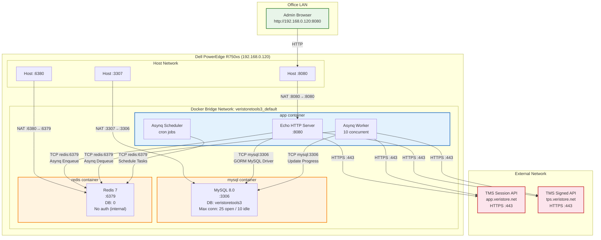
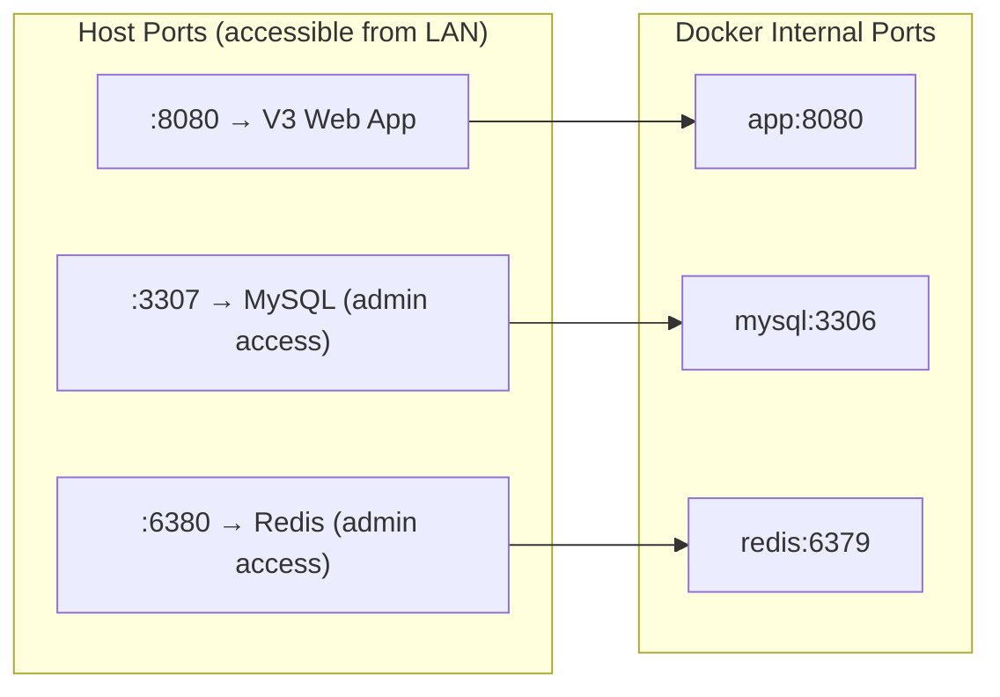
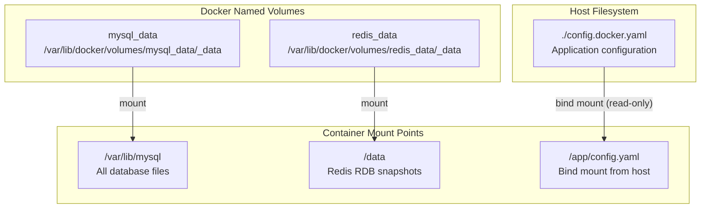
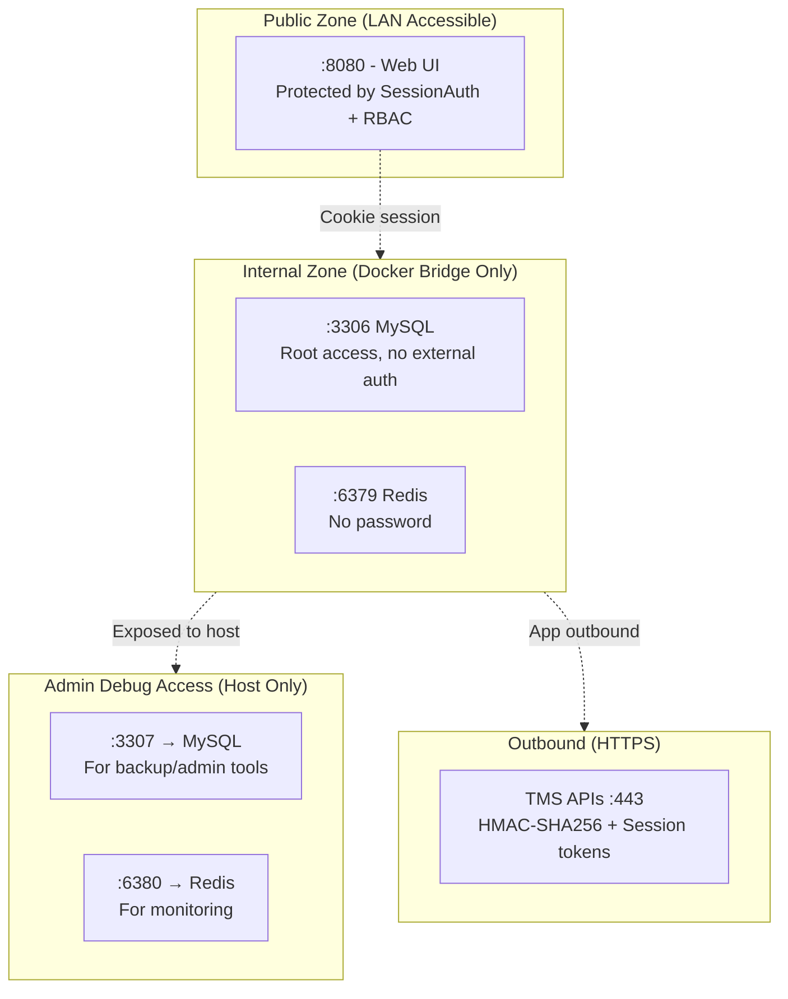

# 8. Infrastructure Diagram

Network topology, Docker bridge, ports, Redis/MySQL connections.

## 8.1 Network Topology



## 8.2 Port Mapping



## 8.3 Docker DNS Resolution

All containers within `veristoretools3_default` bridge network communicate via Docker's embedded DNS:

| Service Name | Resolves To | Port | Protocol |
|-------------|-------------|------|----------|
| `mysql` | 172.x.0.2 (auto) | 3306 | TCP (MySQL protocol) |
| `redis` | 172.x.0.3 (auto) | 6379 | TCP (RESP protocol) |
| `app` | 172.x.0.4 (auto) | 8080 | TCP (HTTP) |

## 8.4 Connection Configuration

### MySQL (from config.yaml)

```
Host:          mysql       (Docker DNS)
Port:          3306        (internal)
Database:      veristoretools3
User:          root
Password:      veristoretools3
Charset:       utf8mb4
MaxOpenConns:  25
MaxIdleConns:  10
DSN: root:veristoretools3@tcp(mysql:3306)/veristoretools3?charset=utf8mb4&parseTime=True&loc=Local
```

### Redis (from config.yaml)

```
Address:       redis:6379  (Docker DNS)
Password:      (empty)
Database:      0
Usage:         Asynq job queue broker
```

### TMS API (from config.yaml)

```
BaseURL:       https://app.veristore.net   (Session API)
APIBaseURL:    https://tps.veristore.net   (Signed API)
AccessKey:     (configured per environment)
AccessSecret:  (configured per environment)
HTTP Timeout:  60 seconds
TLS Verify:    configurable (InsecureSkipVerify)
```

## 8.5 Data Persistence



## 8.6 Scheduled Background Tasks

| Task | Schedule | Description |
|------|----------|-------------|
| `tms:ping` | Every 15 minutes | Health check TMS API session |
| `tms:scheduler_check` | Every 1 minute | Monitor queue health |
| `export:terminal` | On demand | Terminal export to Excel |
| `import:terminal` | On demand | Terminal import from Excel |
| `import:merchant` | On demand | Merchant data import |
| `sync:parameter` | On demand | Parameter synchronization |
| `report:terminal` | On demand | Report generation |

## 8.7 Security Boundaries


